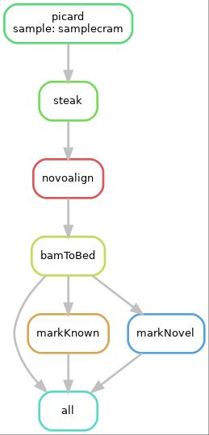

# HERVK_Steak

This is a SnakeMake pipeline which runs STEAK, a tool for discovery of transposable element variants.
It starts with cram to bam conversion if needed, sorting, running STEAK, processing STEAK results to split prediction in novel and known.


<div align="center">
     
</div>

# Requirements

This pipeline requires installation of snakemake pipeline management system, which is easily done by following the instructions here:
https://snakemake.readthedocs.io/en/stable/getting_started/installation.html

It also needs installation of STEAK: https://github.com/applevir/STEAK

All other dependencied are automatically installed at runtime if they are not present.

If you are running this on Rosalind,  STEAK module is already installed and loaded.

## Reference genome
If you already have a reference genome (and it is indexed), update the path to it in config.yaml
If you do not, run the script downloadHG19.sh in order to install it and index it.
```
bash downloadHG19.sh PATH_TO_DIR_TO_PLACE_REFERENCE_GENOME
```
update the path to the newly added and indexed human genome in config.yaml

## Running the pipeline

Once the paths in config.yaml point to CRAM/BAM path, path to the reference genome and the output path - you can run the pipeline on the provided sample.bam in order to predict insertions and split them in known and novel. 

```
snakemake --use-conda --use-envmodules --cores 1 <MY_OUTPUT_DIRECTORY>/{known/sample.knownHits.bed,novel/sample.novelHits.bed}
``` 
This will produce the two result files: 
 <MY_OUTPUT_DIRECTORY>/known/sample.knownHits.bed:  a bed file with known insertions 
 <MY_OUTPUT_DIRECTORY>/novel/sample.novelHits.bed: a bed file with novel insertions
